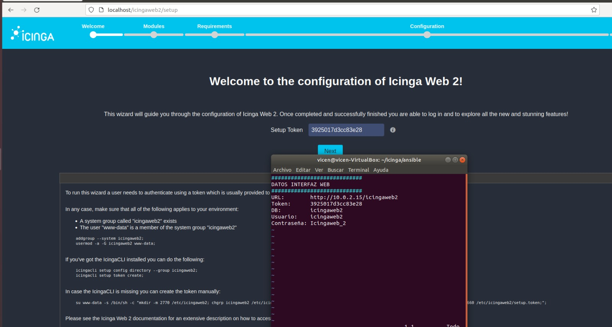
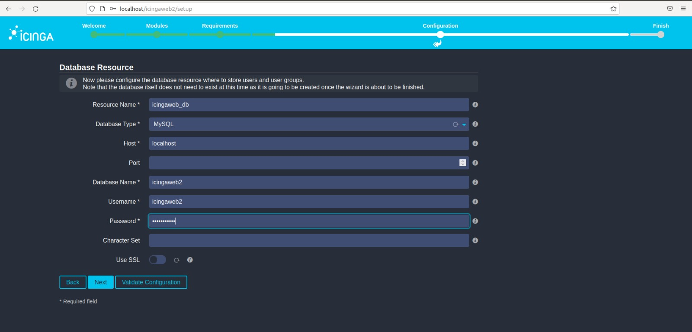
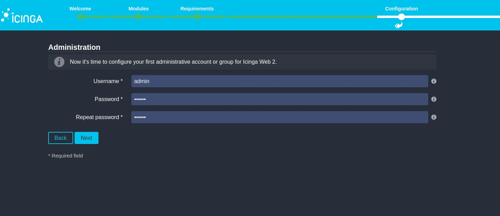
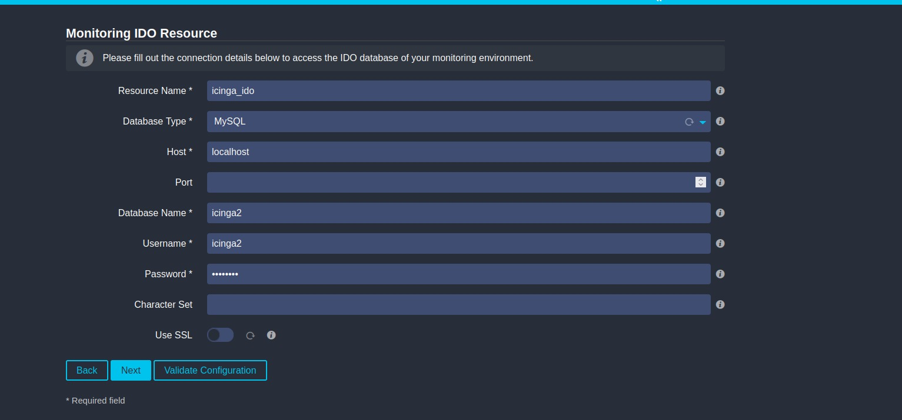
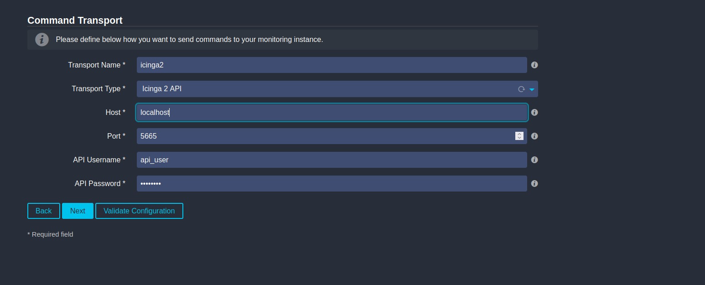
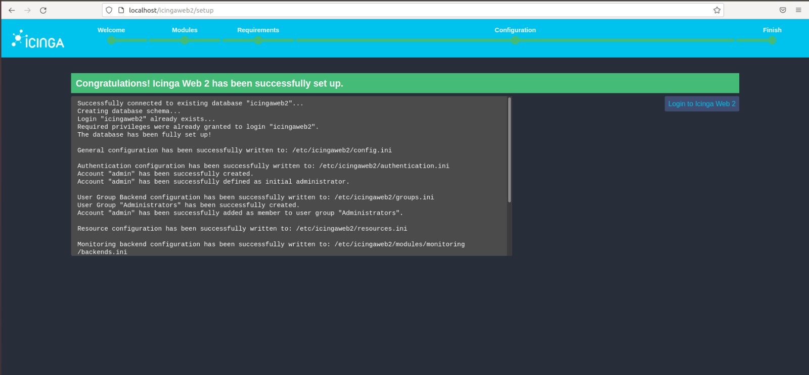
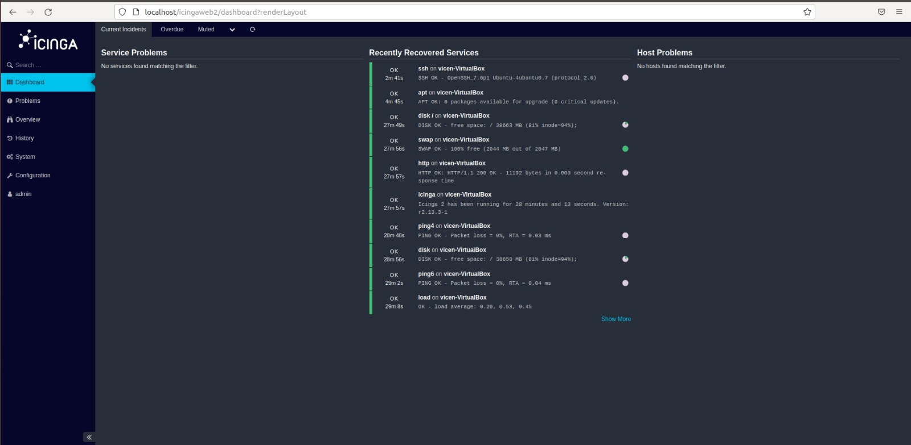

# Configuración Icinga
Una vez hemos instalado Icinga2 y el interfaz Icingaweb2, procedemos a configurar el servicio web.

Si se instala mediante los scripts de Ansible, se habrán generado una serie de ficheros de configuración con los siguientes nombres: HOSTNAME.icingaweb2, HOSTNAME.icinga2 y HOSTNAME.icinga2_mysql.

Accedemos a Icingaweb2 desde el navegador usando la url “localhost/icingaweb2” y seguimos los siguientes pasos:

1.Introducimos el “Setup Token” que se encuentra en el fichero HOSTNAME.icingaweb2:

2.En el siguiente paso, introducimos los datos para configurar la base de datos para la interfaz web (los datos a introducir se encuentran en el mismo fichero del paso anterior):

3.En este paso, indicamos las credenciales que tendrá nuestro usuario administrador en Icingaweb2:

4.En este paso, introducimos los datos de acceso a la base de datos del módulo de MYSQL para Icinga2 (fichero HOSTNAME.icinga2_mysql):

5.Introducimos los datos de acceso a la API remota (fichero HOSTNAME.icinga2):

6.Comprobamos la configuración ha concluido satisfactoriamente:

Accedemos con el usuario administrativo creado y comprobamos que funciona correctamente:

[Volver al inicio](Icinga.md)