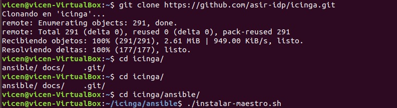

# Instalación de Icinga con Ansible

Para simplificar la instalación hemos utilizado Ansible, que es un framework de automatización de tareas. En el directorio icinga/ansible se encuentra un script bash que realiza la instalación de Ansible y a continuación instala Icinga.

Para utilizar este método, clonaremos el repositorio de instalación en el servidor:

 

[Volver al inicio](Icinga.md)