# Práctica: Despliegue de un servicio de monitorización
## Icinga
Icinga es una aplicación para ordenador de código abierto con el fin de monitorizar sistemas y monitorizar redes. Originalmente fue creada a partir una bifurcación del software Nagios en el año 2009.​​​
## Instalación de Icinga con Ansible

Para simplificar la instalación hemos utilizado Ansible, que es un framework de automatización de tareas. En el directorio icinga/ansible se encuentra un script bash que realiza la instalación de Ansible y a continuación instala Icinga.

Para utilizar este método, clonaremos el repositorio de instalación en el servidor:

 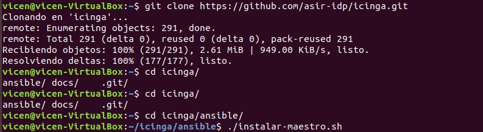

## Configuración Icinga
Una vez hemos instalado Icinga2 y el interfaz Icingaweb2, procedemos a configurar el servicio web.

Si se instala mediante los scripts de Ansible, se habrán generado una serie de ficheros de configuración con los siguientes nombres: HOSTNAME.icingaweb2, HOSTNAME.icinga2 y HOSTNAME.icinga2_mysql.

Accedemos a Icingaweb2 desde el navegador usando la url “localhost/icingaweb2” y seguimos los siguientes pasos:

1.Introducimos el “Setup Token” que se encuentra en el fichero HOSTNAME.icingaweb2:

2.En el siguiente paso, introducimos los datos para configurar la base de datos para la interfaz web (los datos a introducir se encuentran en el mismo fichero del paso anterior):

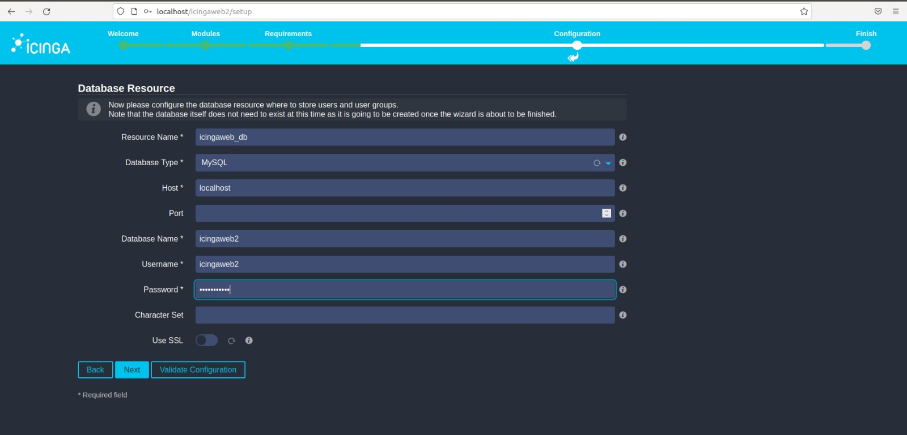

3.En este paso, indicamos las credenciales que tendrá nuestro usuario administrador en Icingaweb2:

4.En este paso, introducimos los datos de acceso a la base de datos del módulo de MYSQL para Icinga2 (fichero HOSTNAME.icinga2_mysql):

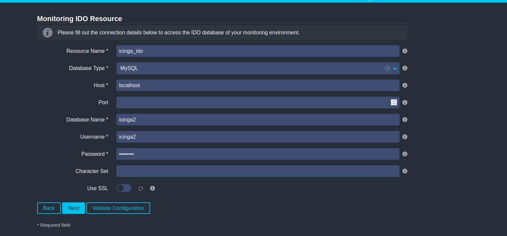

5.Introducimos los datos de acceso a la API remota (fichero HOSTNAME.icinga2):

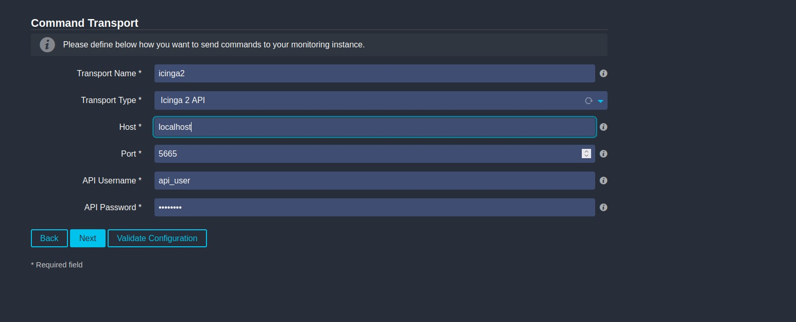

6.Comprobamos la configuración ha concluido satisfactoriamente:

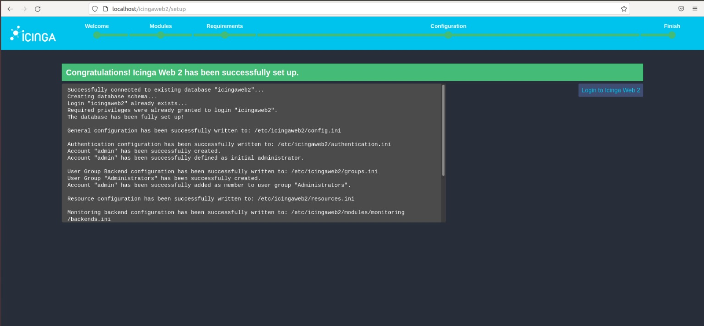

Accedemos con el usuario administrativo creado y comprobamos que funciona correctamente:

## Monitorización Icinga

Lo primero será escribir dentro del fichero /etc/icinga2/conf.d/hosts.conf lo siguiente:

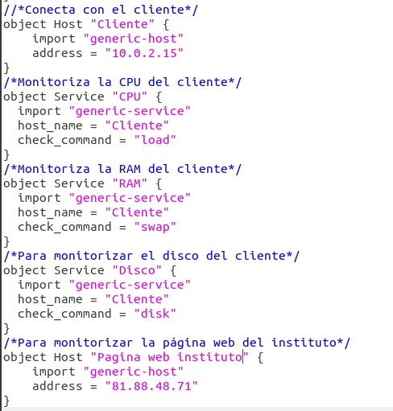

Después pondríamos lo siguiente en el fichero /etc/icinga2/conf.d/services.conf:

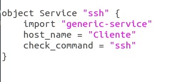

Captura de la monitorización:

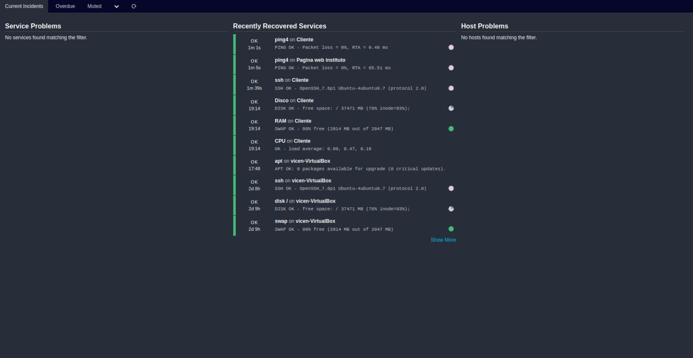

## Configuración de notificaciones

Lo primero que debemos hacer es instalar postfix:

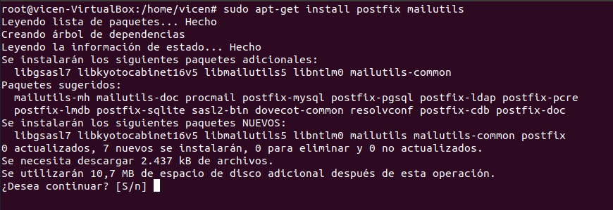

Cuando salga el asistente haremos lo siguiente:

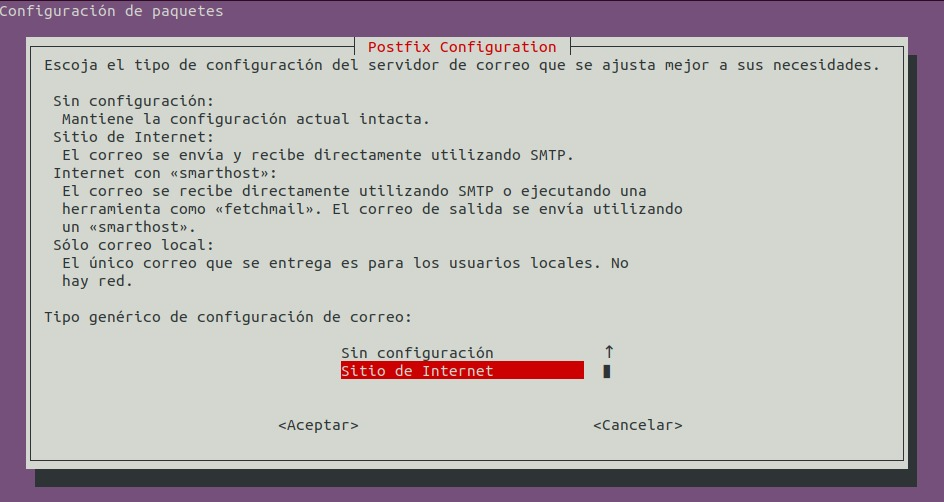

Ponemos el correo para el servidor:

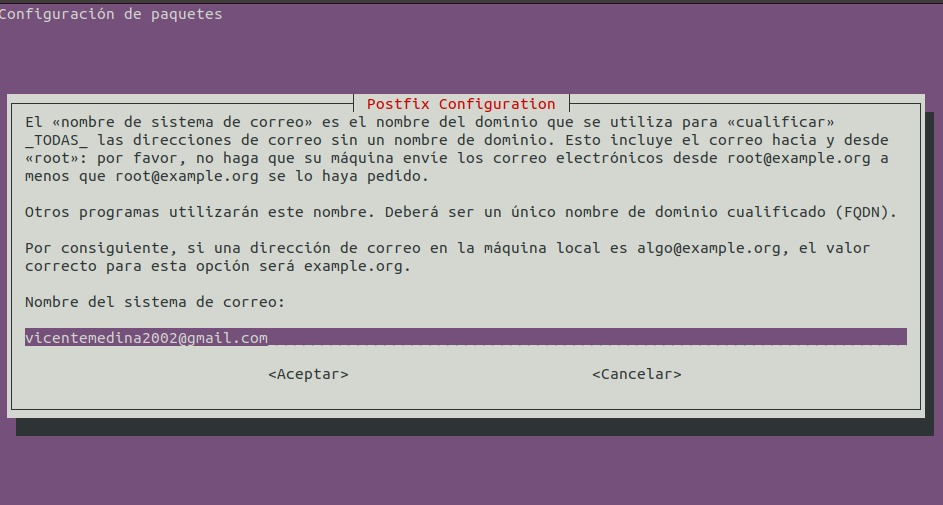

Después iríamos al fichero /etc/icinga2/conf.d/users.conf y pondríamos el mismo correo, el fichero quedaría así:

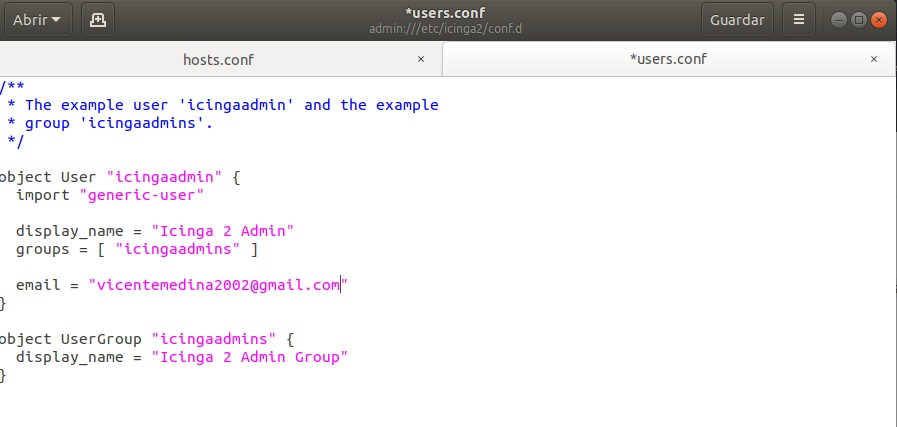

Para recibir notificaciones de un servicio determinado cambiariamos lo siguiente en los ficheros hosts.conf y services.conf:

el fichero host.conf quedaría así:

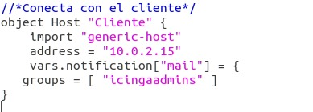

yel fichero services.conf quedariía así:

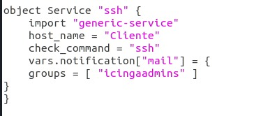

**Prueba del correo**

Para comprobar el funcionamiento apagaré el otro equipo para que me mande un correo:

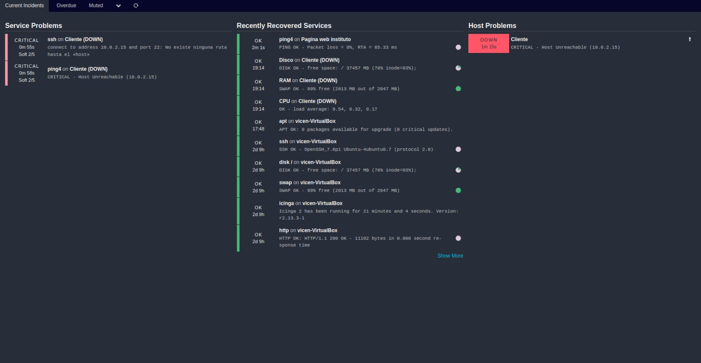

Captura del email recibido

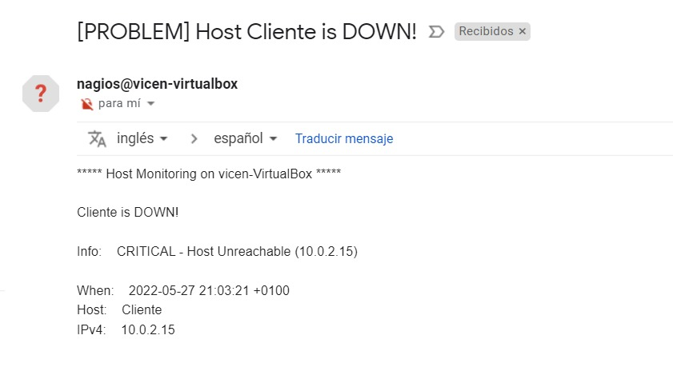

